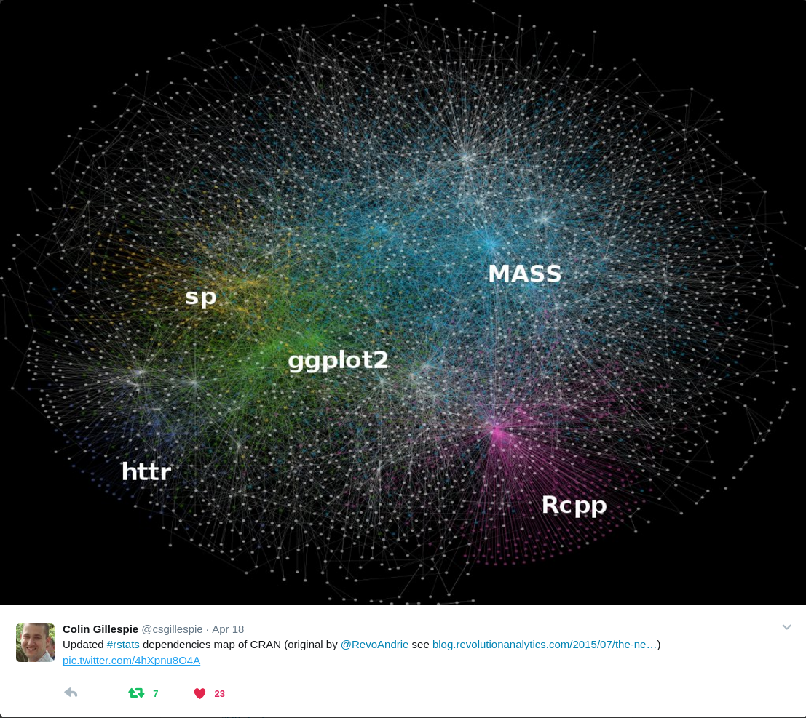
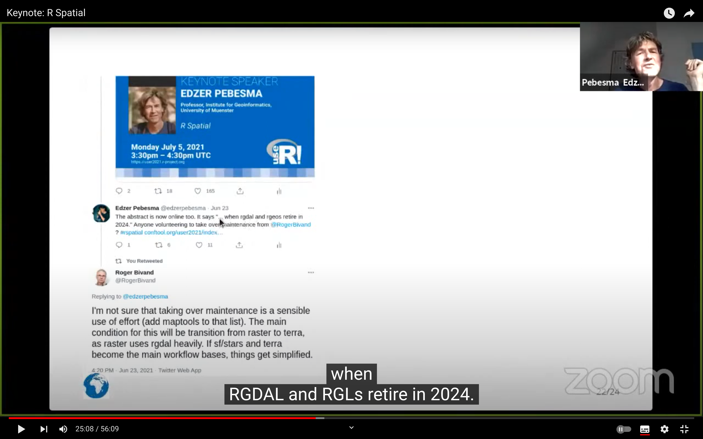
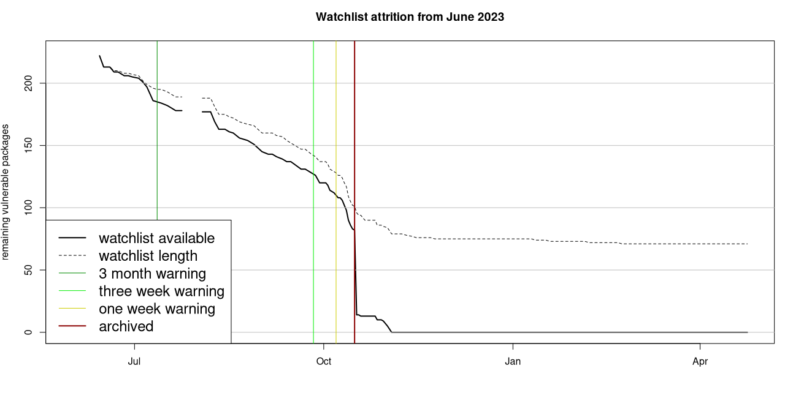
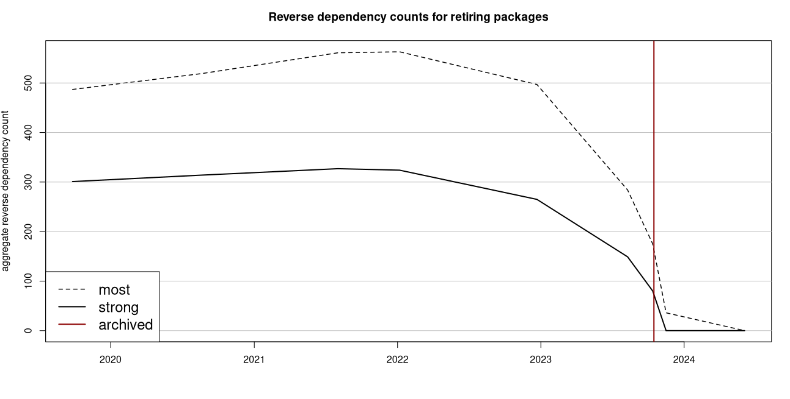
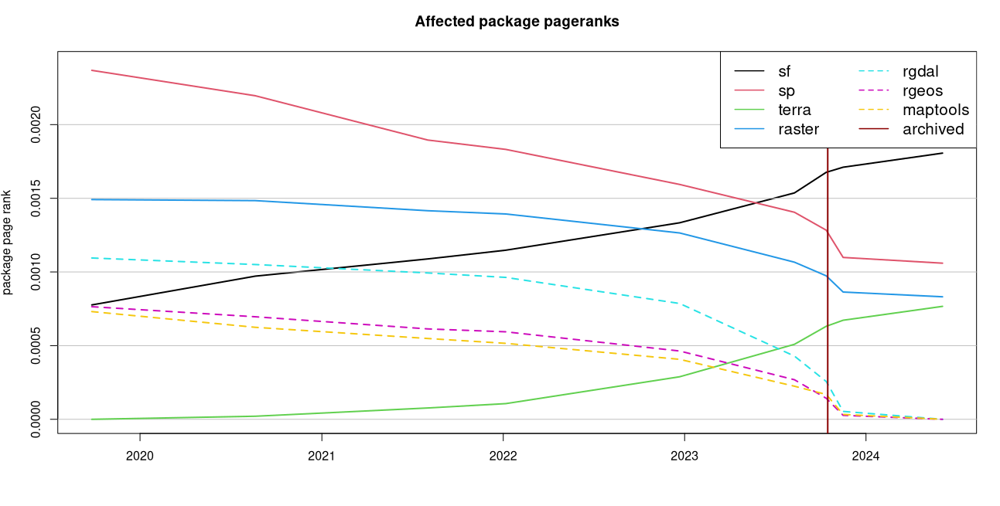

## Overview

* some history of OSGEO and r-spatial
* why packages retire
* how we did it
* lessons learned / future recommendations

## Some history of OSGEO

This community has settled on one standard and three key C++ libraries:

* _Simple Feature Access_, an open standard to define point-, line- and polygon-geometries and multi-forms of those
* **PROJ** a C++ library for cartographic projections and datum transformations
* **GEOS** for geometry measures, predicates and transformers of simple feature geometries
* **GDAL** a library to read and write vector or raster data to/from more than 300 different file formats, databases, or web services

R, Python, Julia, QGIS, ArcGIS, PostGIS, etc all use this.

## Some history of r-spatial (1)

* Spatial R packages have been there from the start, and in S-Plus (e.g., MASS had `spatial`)
* Since 2003 a community converged on using a set of classes for vector and raster data, using packages `sp` and `raster`
* `rgdal` (2003) interfaced GDAL and PROJ
* `rgeos` (2011) interfaced GEOS
* `maptools` was a collection of various useful things
* older, legacy packages include e.g. `maps` and `mapproj`
* `sp` predates simple features, and mirrors shapefiles

----

----

## Reverse dependencies Sep 2021

## Some history of r-spatial (2)

* CRAN binary packages are static builds, meaning they include upstream libraries (GEOS, PROJ, GDAL)
* CRAN check and build systems contain these libraries, they are _not_ vendored in the respective R packages
* the CRAN team needs to regularly update, or rebuild these
* this involves communication (both ways), attention, and problem solving skills

## Some history of r-spatial (3)

* `sf` came out in 2016 and supports simple features in R
* it uses S3 rather than S4, integrates with `tidyverse` and `ggplot2`
* `stars` (2018) provided classes for the raster side and data cubes
* `terra` (2020) uses S4 classes for raster and vector, and succeeds `raster`

## Why packages retire

* Maintaining packages can be a lot of work
* Packages can get superseded by better solutions
* Maintainers retire!

## Why `rgdal`, `rgeos` and `maptools` retired

* Roger Bivand, their maintainer, retired
* The code is hard to read 
    * uses `.Call()`, rather than `Rcpp` or similar
    * many conditional branches for upstream changes
* simple features in R (`sf`) simplifies life, a lot.
* raster data analysis moved to stars (2018) and terra (2020)
* R Consortium funded an _evolution_ project (Sept 21 call)

----

---- 

## How?

* terra in 2018-20 took over `rgdal` dep from raster
* progress reported to r-spatial evolution blogs (for motivation)
* handling reverse dependencies (starting 2022 RC project)
   - package raster dropped dependency on rgdal and rgeos (Sept 2022), using terra instead
   - reverse dependency checks, emulating removal; monitor
   - **heavy** startup warnings in `sp` (worried people who were not affected!)
   - remove `rgdal` and `rgeos` dependencies of `sp` in june 2023

----

https://link.springer.com/article/10.1007/s10109-020-00336-0

## Harder dependencies

* `fiesta` (USDA) developed `gdalraster`, which provides a low-level GDAL interface for R
* `URSA` now imports `sf`, and suggests `gdalraster`, `terra`, and `stars`
* More response from GH issues than from emails to pkg maintainers
* it was necessary to be irritating, and provide patches for numerous pkgs (by RB); 
* `pkgapi` was very useful: what is a package using? (S4 methods reporting patchy)

##  Watchlist: started jun 2023

* ran nightly to see whether a revision had appeared
* check whether it fixed revdep issue, look into & report
* final removal at release date of R 4.1 (Oct 2023)
* Watchlist output and code used is on the GH evolution repo.
* Data and wode is on [github.com/r-spatial/evolution](https://github.com/r-spatial/evolution)

----

----

----

## Recommendations

If you want to retire one or more heavily used CRAN packages and limit damage to CRAN:

* announce early, widely, loudly and often
* actively approach package maintainers, irritate them, help them
* closely watch the development of reverse dependencies
* communicate with the CRAN team
* ask for help and support from the community

## Thanks to

* Roger Bivand for his tireless efforts
* R Consortium for supporting this project
* A reference group of key package developers and user community representatives who helped us giving feedback on planning and approach